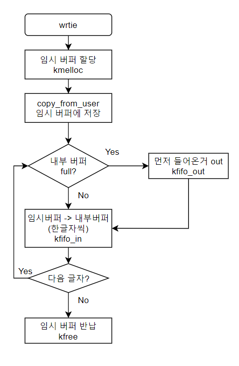

# 문자 디바이스 드라이버 개발

가상 문자 디바이스 드라이버 개발 프로젝트로 리눅스 커널 메모리에 kfifo 공간을 할당받고 유저모드에 값을 받아와 커널 메모리(kfifo)에 write, read 하도록 하는 디바이스 드라이버를 개발한다.
모듈 프로그래밍으로 리눅스 커널에 적재하여 테스트를 진행한다. 유저모드에서는 저수준 파일 시스템을 이용하여 디바이스 드라이버 호출한다. 프로그램은 (1)디바이스드라이버와 (2)(3)커널 버퍼 크기 조절 프로그램으로 구성된다. write, read는 cat 명령어를 이용하도록하여 따로 구현하지 않는다.


# 요구 명세
-	드라이버 이름: BufferedMem
-	개발환경: Ubuntu 16.04.7
-	BufferedMem 장치 Major Number: 275 
-	사용자 write한 정보 내부 버퍼에 유지
-	내부 버퍼 크기(N) 사용자가 변경 가능
-	사용자 입력 데이터가 최대 내부 버퍼 크기를 초과한 경우 최초 입력된 데이터부터 삭제
-	사용자가 Read할 경우 M 바이트만 전달
-	사용자 Read Buffer Size (M) 크기 변경가능
-	Read 된 데이터는 내부 버퍼에서 제거
-	N, M 변경은 ioctl 이용
-	Device Driver를 등록할 때 N, M 사용자 지정 가능
-	내부 버퍼는 kfifo로 구현
-	디바이스 등록 및 제거 시 로그 메시지 출력
- 등록 시: Device driver registered 출력 
- 제거 시: Device driver unregistered 출력
 

### 작성 프로그램: 
-   BufferedMem Device Driver – BufferedMem 장치의 device driver 
-	ch_read_buffer_size – 장치로부터 read할 때 읽어 들이는 데이터 크기 조절 프로그램 
-	ch_wirte_buffer_size – write된 데이터를 저장하는 내부 버퍼 크기 조절 프로그램 
-	Makefile 


### 상세 기능
-	내부 버퍼 크기 가변형 구현 
-	Read 기능
-	Write 기능
-	N/M 크기 초기화
-	N 변경 기능
-	M 변경 기능 
- 로그 출력 기능 
-	디바이스 파일 생성 

---
# documate

## ①	모듈 적재, 제거
```
module_init(BufferedMem_init);
module_exit(BufferedMem_exit);
MODULE_LICENSE("GPL");

struct kfifo fifo_buffer; // 내부 버퍼
```
-	모듈 적재 시 kfifo 내부 버퍼 할당(할당된 버퍼 사이즈 로그출력)
-	모듈 적재 시 디바이스 드라이버 등록
-	드라이버 등록 시 ‘Device driver registered’ 출력
-	모듈 제거 시 kfifo 자원 반납
-	모듈 제거 시 디바이스 드라이버 제거
-	드라이버 제거 시 ‘Device driver unregistered’ 출력

## ②	file_operations 구조
```
static struct file_operations BufferedMem_fops = {
    .owner = THIS_MODULE,
    .open = BufferedMem_open,
    .release = BufferedMem_release,
    .write = BufferedMem_write,
    .read = BufferedMem_read,
    .unlocked_ioctl = BufferedMem_ioctl,
};
```
Open, Release 실행 시 로그 출력

## ③	write()

```
char * write_buffer= kmalloc(length, GFP_KERNEL);  
```
-	유저 모드에서 write 시 입력되는 데이터를 커널로 복사하기 위한 버퍼 생성
-	버퍼 생성 실패 시 오류 메시지 출력 후 종료
-	버퍼 사이즈는 입력으로 들어온 크기만큼 length 변수
-	Write 종료 서 버퍼 반납
```
if (copy_from_user(write_buffer, buf, length)){
```
-	유저 메모리 커널로 복사
```
for(i = 0; i<length;i++){
    if(kfifo_is_full(&fifo_buffer)){
        kfifo_out(&fifo_buffer, &onec, sizeof(onec));
    }
    onec=write_buffer[i]; //유저에서 받은 값 내부버퍼에 입력
    kfifo_in(&fifo_buffer,&onec,sizeof(onec));  
}
```
-	유저 데이터 복사한 버퍼에서 한 글자씩 내부 버퍼에 입력
-	입력 크기가 버퍼 남은 공간보다 크면 먼저 들어온 데이터 제거 후 입력


---
## 제작 후 특이 사항
-	메모리를 동적으로 할당하는 경우 로그 출력으로 할당과 자원 반납을 모니터링 가능.
-	사용자 커널 간 데이터 copy할 때 임시 버퍼 필요할 때마다 생성 후 반납하여 자원관리.
-	메모리 동적할당 할 때 실패하면 오류 메시지 실행 후 함수 종료.
-	Default 내부 버퍼 사이즈 : 32, Read 버퍼 사이즈 : 3
-	내부 버퍼 크기 변경 시 데이터가 저장되어있었으면 그대로 복사.
 (단. 기존 버퍼 크기 보다 작은 크기로 변경 시, 데이터 뒤에서부터 버퍼 크기만큼 남김)
-	사용자가 입력한 버퍼 크기와 실제로 변경된 버퍼 크기를 비교하도록 커널에서 버퍼 크기 변경 후 크기를 유저 모드로 보내 프로그램에서 출력 가능.
